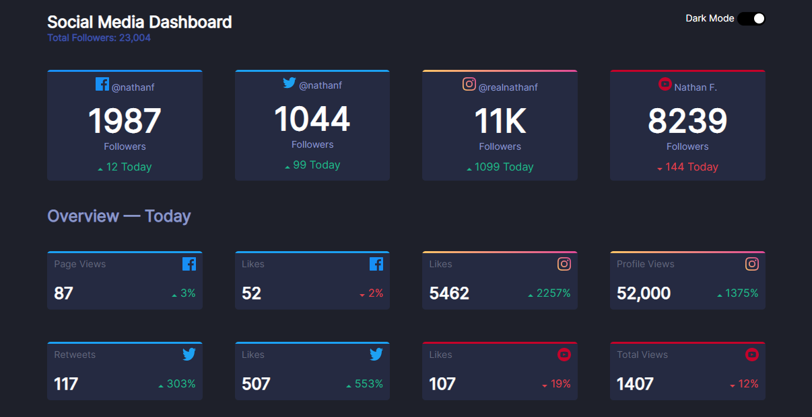

# Frontend Mentor - Social media dashboard with theme switcher solution  

This is a solution to the [Social media dashboard with theme switcher challenge on Frontend Mentor](https://www.frontendmentor.io/challenges/social-media-dashboard-with-theme-switcher-6oY8ozp_H).  

## Table of contents  

- [Overview](#overview)  
  - [The challenge](#the-challenge)  
  - [Screenshot](#screenshot)  
  - [Links](#links)  
- [My process](#my-process)  
  - [Built with](#built-with)  
  - [What I learned](#what-i-learned)  
  - [Continued development](#continued-development)  
  - [Useful resources](#useful-resources)  
- [Author](#author)  
- [Acknowledgments](#acknowledgments)  

## Overview  

### The challenge  

Users should be able to:  

- View the optimal layout for the site depending on their device's screen size  
- See hover states for all interactive elements on the page  
- Toggle color theme to their preference  

### Screenshot  

  

### Links  

- Solution URL: [Add solution URL here](https://github.com/Verciv/social-dashboard-problem)  
- Live Site URL: [Add live site URL here](https://verciv.github.io/social-dashboard-problem/)  

## My process  

### Built with  

- Semantic HTML5 markup  
- CSS custom properties  
- Flexbox  
- CSS Grid  

### What I Learned  

- A method in aligning flex items to corners involves displaying two divs in column orientation and displaying the child elements in rows to align flex items in corners  

### Continued development

- Add additional comments  

### Useful resources  

- [Example resource 1](https://www.w3schools.com) - This helped me with some documentation.  

## Author  

This project was made by Verciv.  
